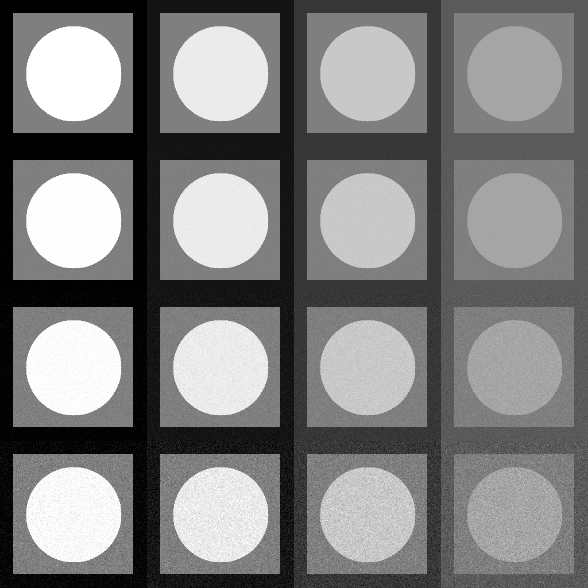
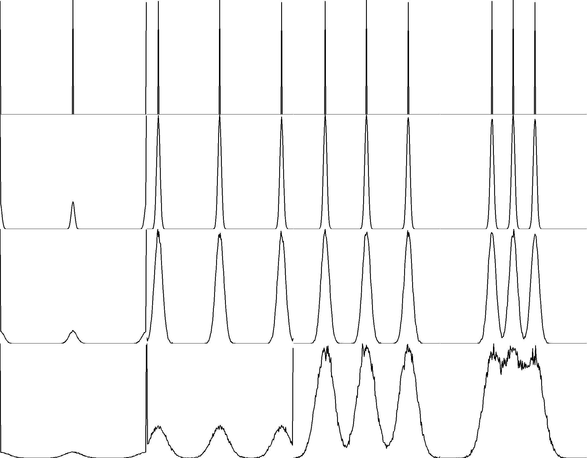

# Отчет по лабораторной работе №2  

---

## Что было сделано  

В этой лабораторной работе был реализован код для генерации тестовых изображений, добавления шума, анализа статистических параметров и визуализации гистограмм яркости.  

---

## 1. Создание коллажа  

- Исходные изображения склеиваются по горизонтали с помощью `cv::hconcat`.  
- К склейке добавляется шум, и зашумленные версии склеиваются с исходной склейкой по вертикали с помощью `cv::vconcat`.  

  

---

## 2. Анализ статистик  

### 2.1. Расчет статистических параметров  
Для каждого изображения (исходного и зашумленного) программа рассчитывает статистические параметры:  
- **Среднее значение** (`mean`).  
- **Стандартное отклонение** (`stddev`).  

### 2.2. Области анализа  
Эти параметры рассчитываются для трех областей:  
- **Фон**  
- **Квадрат**  
- **Круг**  

### 2.3. Результаты анализа  
Для всех сгенерированных вариантов изображений (исходных и зашумленных) были проведены оценки статистических параметров. Результаты сохраняются в CSV-файл `output_collage_stats.csv`.  

Пример содержимого файла:  
```csv
Image,Region,Mean,StdDev
Image 1,Background,0.0,0.0
Image 1,Square,188.571406,66.315882
Image 1,Circle,255.0,0.0
...
Noisy Image 4 (std=15),Background,90.094001,14.886633
Noisy Image 4 (std=15),Square,145.368027,24.667431
Noisy Image 4 (std=15),Circle,165.097647,14.807679
```

### 2.4. Сравнение с теоретическими значениями  

- **Исходные изображения**:  
  - Для фона, квадрата и круга средние значения (`mean`) соответствуют заданным уровням яркости (`lev0`, `lev1`, `lev2`).  
  - Стандартное отклонение (`stddev`) близко к нулю, так как исходные изображения не содержат шума.  

- **Зашумленные изображения**:  
  - Средние значения остаются близкими к исходным, так как шум является несмещенным.  
  - Стандартное отклонение увеличивается пропорционально уровню шума (`std = 3, 7, 15`).  

### 2.5. Выводы  
- Добавление шума не влияет на среднее значение яркости, что подтверждает несмещенность шума.  
- Стандартное отклонение увеличивается с ростом уровня шума, что соответствует теоретическим ожиданиям.  

---

## 3. Визуализация гистограмм  

- Для каждого изображения строится гистограмма яркости с помощью `cv::calcHist`.  
- Гистограммы склеиваются в одну большую картинку в соответствии с положением изображений в коллаже.  

  

---

## Результаты  

- **Коллаж изображений**: сохранен в `output_collage.png`.  
- **Гистограммы яркости**: сохранены в `output_histogram.png`.  
- **Статистические данные**: сохранены в `output_collage_stats.csv`.  