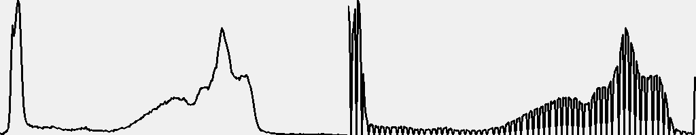
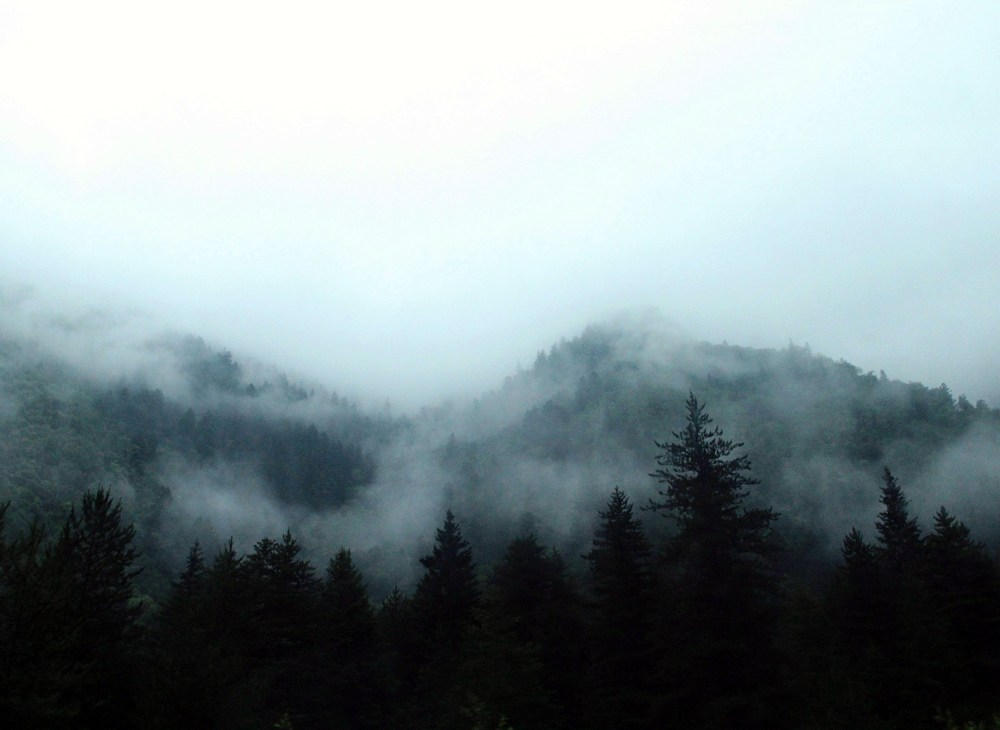
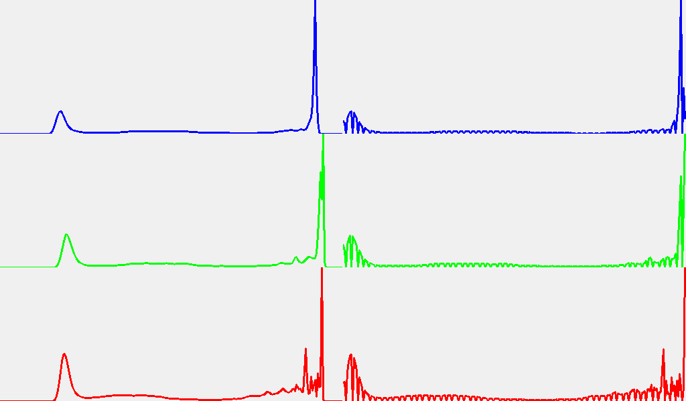
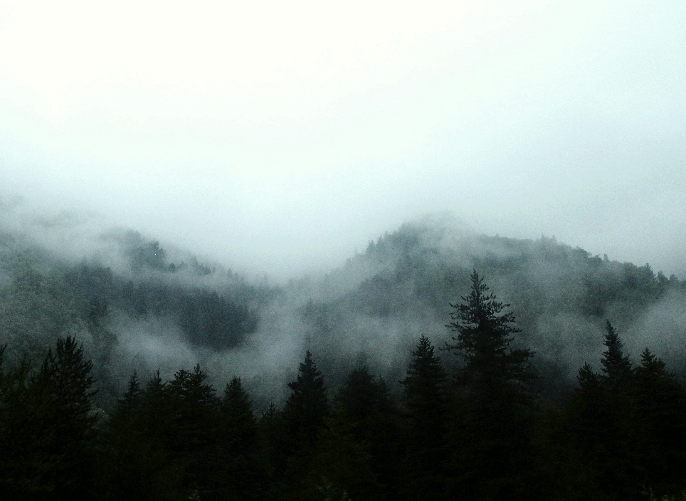
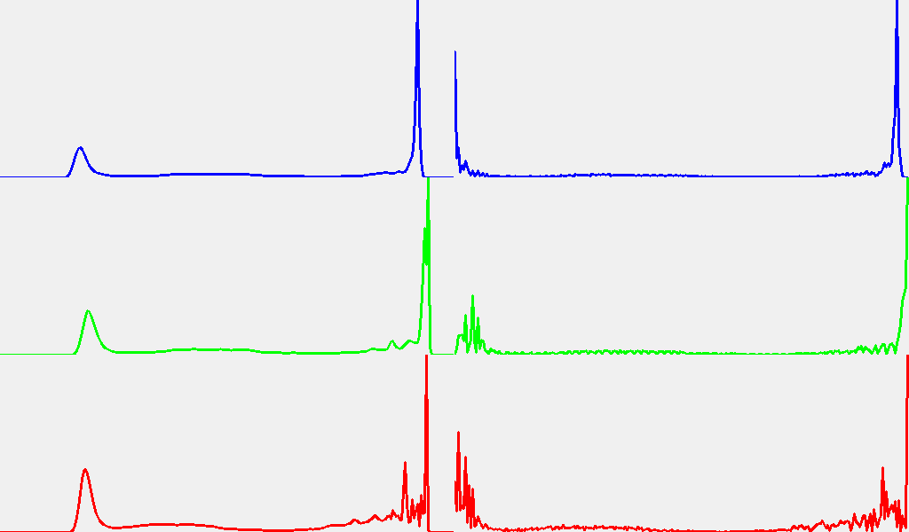
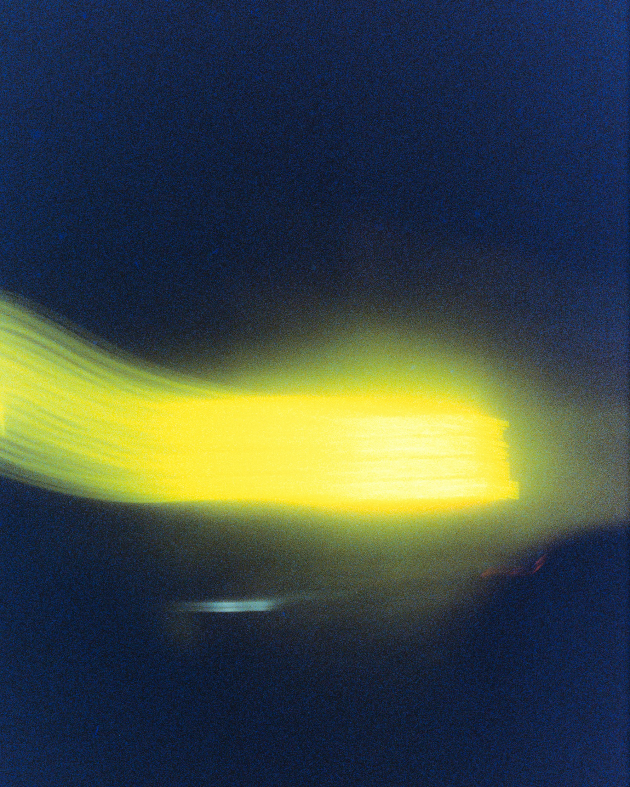
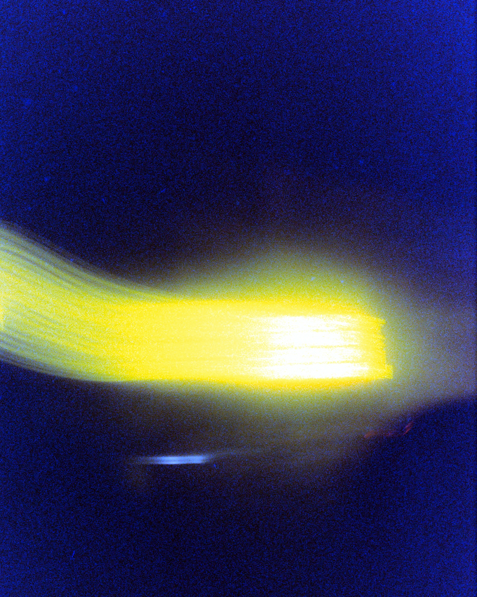
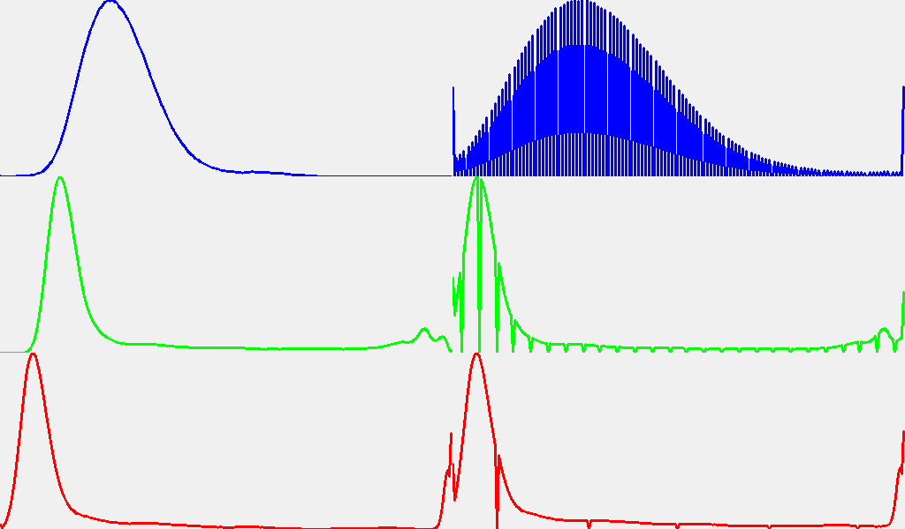
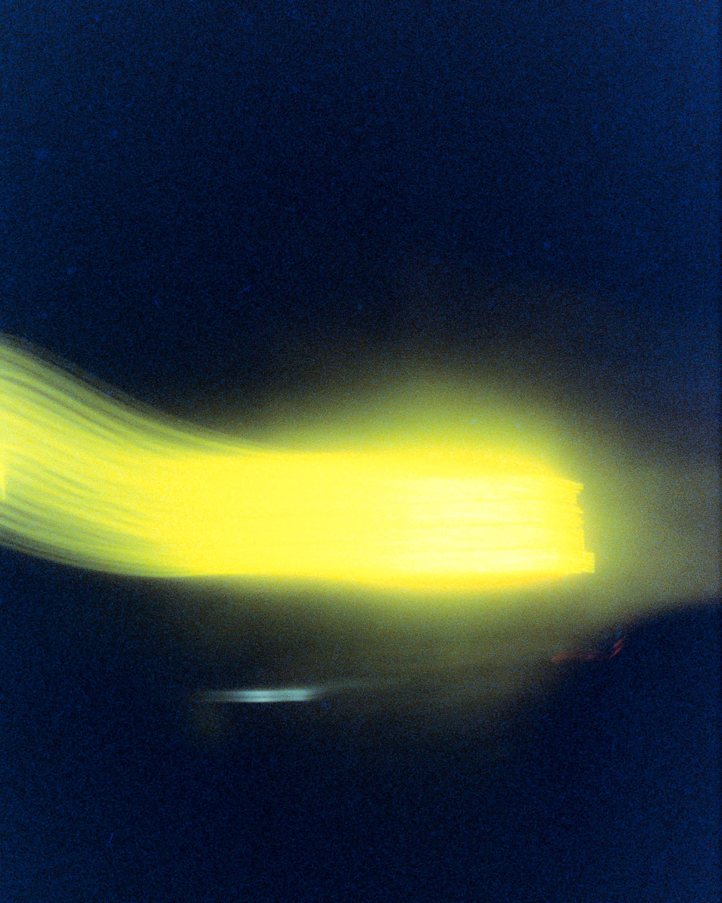
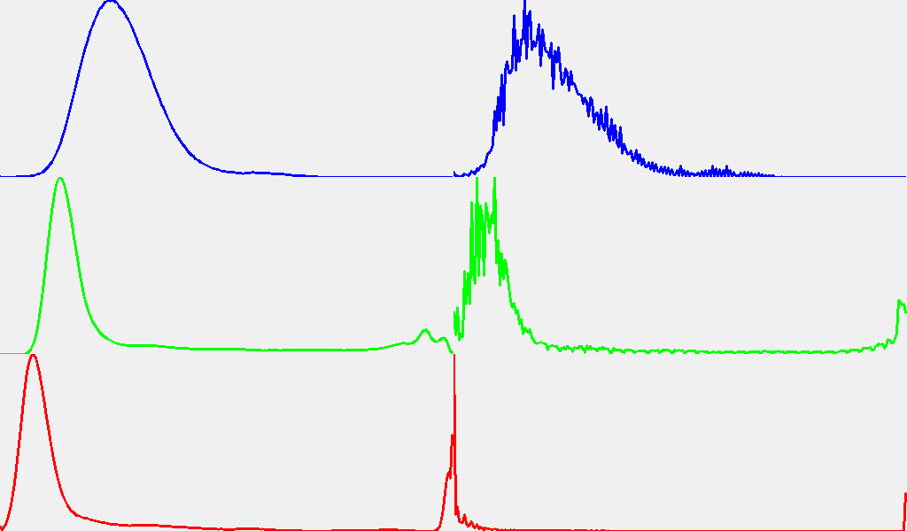

# Отчет по лабораторной работе №3: Автоконтрастирование изображений

---

## Что было сделано

В этой лабораторной работе были реализованы и протестированы различные методы автоконтрастирования изображений:
1. Наивный метод для серых изображений
2. Наивный метод для цветных изображений (по каналам)
3. Улучшенный метод для цветных изображений с сохранением цветового баланса

---

## 1. Тестирование и анализ

### 1.1. Тестирование на серых изображениях
Пример работы на изображении "cameraman.jpg":

**Исходное изображение**:

**Итоговое изображение**:

**Гистограмма до/после обработки (q_black=0.01, q_white=0.01)**:

**Вывод**:
- Улучшилась различимость деталей в теневых и светлых областях
- Динамический диапазон яркостей расширен
- Гистограмма равномернее распределена по всему диапазону

### 1.2. Тестирование на цветных изображениях

### Позитивный пример:
**Исходное изображение**:

### **Результаты**:
#### Наивный
 
#### Гистограмма (q_black=0.01, q_white=0.01)

---

#### RGB

#### Гистограмма (q_black=0.01, q_white=0.01)
 

**Вывод**: 
- Визуальные различия результатов минимальны
- Оба метода приводят к схожему распределению яркостей
- Для сбалансированных изображений допустимо использование любого метода

### Негативный пример:
**Исходное изображение**:

### **Результаты**:
### Наивный
 
#### Гистограмма (q_black=0.01, q_white=0.01)
 

---

### RGB

#### Гистограмма (q_black=0.01, q_white=0.01)
 

**Вывод**:
- Наивный метод вызывает сильные цветовые искажения
- RGB метод сохраняет естественные цвета, улучшая только контраст
- Наивный подход:
	- Каждый цветовой канал растягивается независимо
	- Гистограммы каналов смещаются по-разному, нарушая баланс
	- На выходе: цвета искажаются, появляются неестественные оттенки
- RGB: 
	- Обрабатывается только канал яркости 
	- Цветовые каналы остаются без изменений
	- Гистограмма яркости растягивается, сохраняя цветовой баланс
- Причины различия:
	- Наивный метод обрабатывает каналы по отдельности
	- RGB метод учитывает взаимосвязь цветовых компонентов

---

## 2. Результаты

### 2.1. Полученные изображения
- Все обработанные изображения сохранены в папке `output_images/`
- Гистограммы сохранены в папке `output_histograms/`

### 2.2. Выводы
1. Наивный метод хорошо подходит для серых изображений
2. Для цветных изображений предпочтительнее использовать RGB метод
3. Наивный метод может значительно искажать цвета при дисбалансе каналов
4. RGB метод обеспечивает коррекцию контраста без изменения цветовых характеристик изображения.
